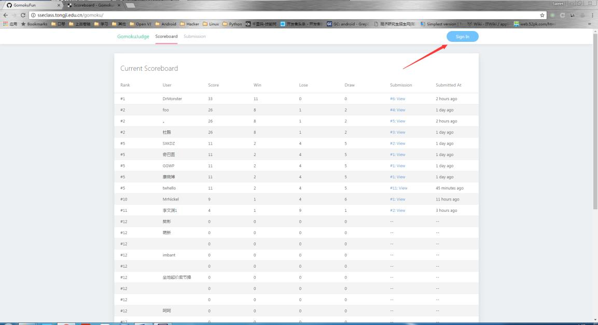

## 人工智障开发指南

### 1.几点说明

首先，同学们最关心的问题：我们需要提交什么？

我们的大项目需要同学们最后提交 1 份 C 代码到评测平台上，评测平台长这个样子，可以实 时看到目前的排行榜：


但是，这个评测平台限制了同学们的提交频率（目前是 5 分钟 1 次，到后面提交的人多了以后，会将频率改为 1 天 1 次）。所以，你不可能每修改完一次 AI 就提交到评测平台上进行排位，万一因为一点小错误，导致 AI 的表现与预期不符，下次提交就是明天啦！所以最好是经过认真调教以后，确认 AI 的表现与自己的预期相符时，再提交到评测平台上进行排位。

那么问题来了，如果进行本地调试（可以自己与 AI 对战或是不同的 AI 相互对战）呢？这里 提供了一份客户端与服务端程序供同学们进行调试，提供这份代码的意义在于，你不可能在评测平台上看到实时的图形化展示 AI 的每一步运行详情。而本地调试可以看到 AI 每次落子 时，其内部的各种变量的取值，方便进行调参。下面就来讲解如何进行本地调试。

### 2. 本地调试

本地调试所需要的项目文件为 **win-server** 和 **win-client**，如何使用详见里面的说明文档。很多同学不明白这个项目与线上测评机的区别，该项目是用于本地（局域网）人 vs AI、人 vs 人、AI vs AI，是方便大家调试自己的 AI 的环保公益项目。**win-server** 和 **win-client** 使用了 C 语言的 Socket 编写，（https://baike.baidu.com/item/socket/281150?fr=aladdin）。而我们的测评环境是使用std进行通信的，即标准输入输出流：

“该项目为个人项目，学生需要独立完成。学生需要使用 C 语言实现一个 Makyek 走子程序（以下称为大脑程序），使用 stdin 来接收对手落子情况、通过计算后使用 stdout 输出自己的落子（见输入输出格式）。算法不限，但有时间和内容上的限制（见比赛规则）”

为了方便大家使用，win-client已经将相关的通信协议以及GUI相关代码隐去（见main.c），抽象出了 AI 层面的框架，即 ai.c 文件，同学们只需要在 ai.c 文件上进行修改即可。当修改完自己想要的 ai 后，可以通过一个最简单的方法进行测试：与 AI 对战一盘，可以参考如 下指令进行人机对战：

首先，打开一个服务器，在 win-server 的 src 目录下执行 server：


然后，以 DEBUG 模式启动一个客户端，表示人类选手：在 win-client 的 src 目录下执行 client -D： 


这样，我们就启动了一个人类选手的界面。

最后，我们还需要再启动一个客户端，表示我们的 AI 选手。在 win-client 的 src 目录下执行 client： 


这样子，AI 选手就启动了。 

如果双方成功与server链接，右上角会显示Connected字样，并且会显示你是属于黑子还是白子，同时棋盘会被初始化。

此时，我们应该回到人类选手的客户端，即第一个启动的客户端进行棋子移动（棋子移动的方法为直接用鼠标点击想要移动的棋子，**等到右下角log面板出现 Choose X Y 字样再点击想移动到的目标地点**，由于 c 的命令行下指针有问题，所以如果出现点击没有反应时请**暴击你的鼠标**）： 


执行移动命令之后，可以在两个client面板中看到棋盘被刷新，同时通信会显示在右下角滚动的log面板中，可以看到 AI 选手迅速给出了她的选择(A0)。然后，你可以继续进行移动以测试 AI 选手是否 按照预期进行移动。


最后，你可以继续移动棋子，直到棋局结束： 


如果 AI 选手的移动符合你的预期，恭喜你，你可以将你的 AI 提交到评测平台上与整个年级 的 AI 进行对抗，看看你的 AI 最终排在哪里。如果 AI 选手的脑回路不符合你的预期结果，请 继续调教直到她正常工作为止。 接下来，我们讲解如何将本地的 AI 移植到评测机上进行评测。 

### 3. 本地调试转线上测评

前面也提到了，本地对战是基于 Socket 协议的，而线上评测平台是基于 std 的。所以我们不可能直接将本地的 ai.c 文件提交到评测平台上进行对战。幸运的是，我们已经有了一份骨架 项目 win-std-client，你可以将你的 ai 移植到这个项目里，然后再进行提交。 首先打开 win-std-client 项目里面的 main.c 文件，可以看到这份文件的开始部分有几个函数与我们的 ai.c 文件一模一样： 


所以你只需要把你所编写的 ai.c 文件里从

```c
/**
 * YOUR CODE BEGIN
 * 你的代码开始
 */
```

一直到

```c
/**
 * 你的代码结束
 */
```

所包含的代码复制到 main.c 对应的位置即可，这样子就完成了 AI 从本地版本移植到线上评 测机版本的工作，是不是非常简单呢？ 


现在，让我们尝试一下提交第一位 AI 选手：

首先打开评测平台（http://sseclass.tongji.edu.cn/gomoku/），点击 Sign In。



初始的用户名和密码都为学号，第一次登陆后会强制更改密码。


进去了以后请按照要求填写好自己的相关信息：


填好后，点击 Submission 按钮，再点击右侧的 Submit New Brain 提交一份 AI


在这个提交页面里，提交你所编写好的移植代码（也可以原封不动的直接提交 win-std-client 里面的 main.c 文件），该代码的线上地址为 https://github.com/sse2018-makyek-fun/std-client/blob/master/main.c.


提交后可以看到正在编译(Compiling)中：


刷新一下，变成 Running 表示正在进行评测：


最后变成 Effective 表示这是一个有效提交（即完成了所有对局），点击 Detail 进行查看对局 详情：


Wow，我们的天然呆选手竟然这么厉害：


可以点击对战结果进行对战详情的查看：


可以看到具体的输赢情况：


最后，我们还可以点击 View 查看本次对局结果的棋盘：


对局结果的棋子分布如下，可以点击如下按钮，来查看每一步的对局情况。


进入逐步查看对局情况的页面后，

- 可以点击`Previous`和`Next`按钮，以及输入step、点击`Go`按钮来观看不同回合的对局情况。
- 其中红色的方块为移动棋子之前的位置，绿色的方块为移动棋子之后的位置。
- 可以点`Current Stdin`来查看双方的大脑程序到当前回合，接收的输入。


最后，我们可以查看排行榜，看看自己是第几位：


好了，是时候开发自己的 AI 了，目标是挑夹棋大师！