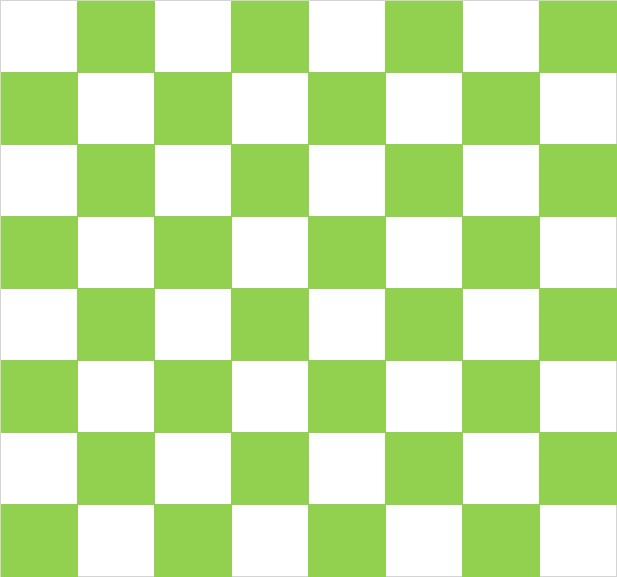
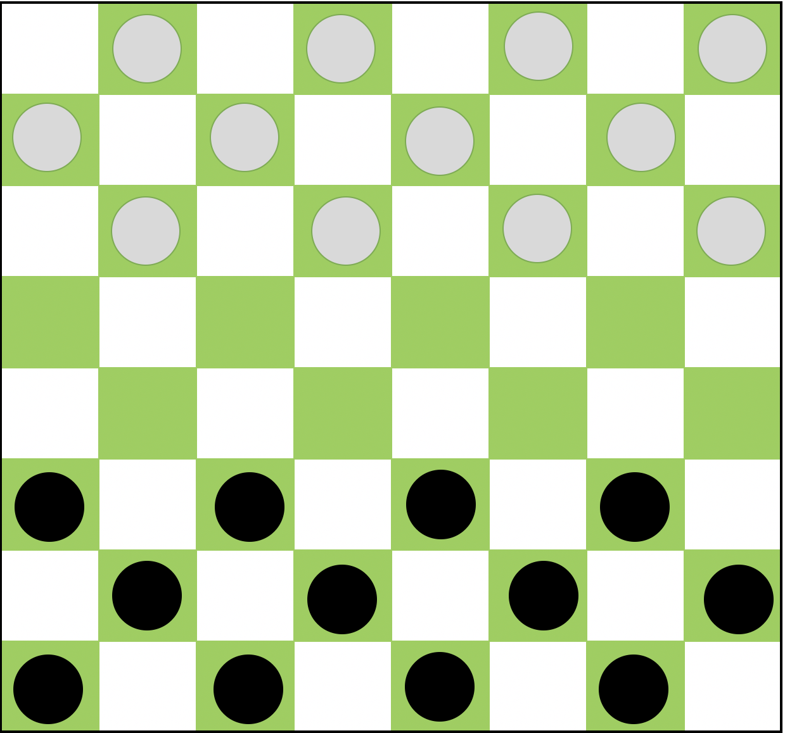
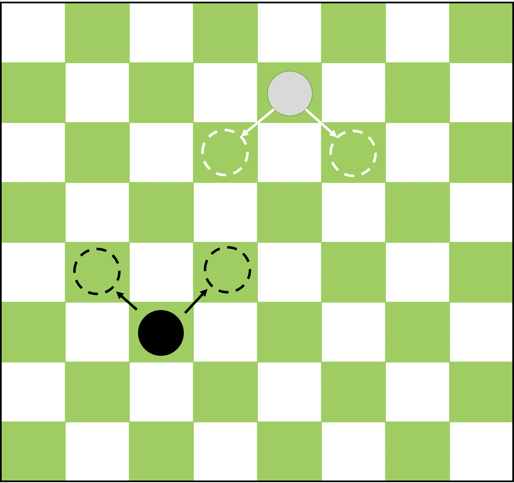
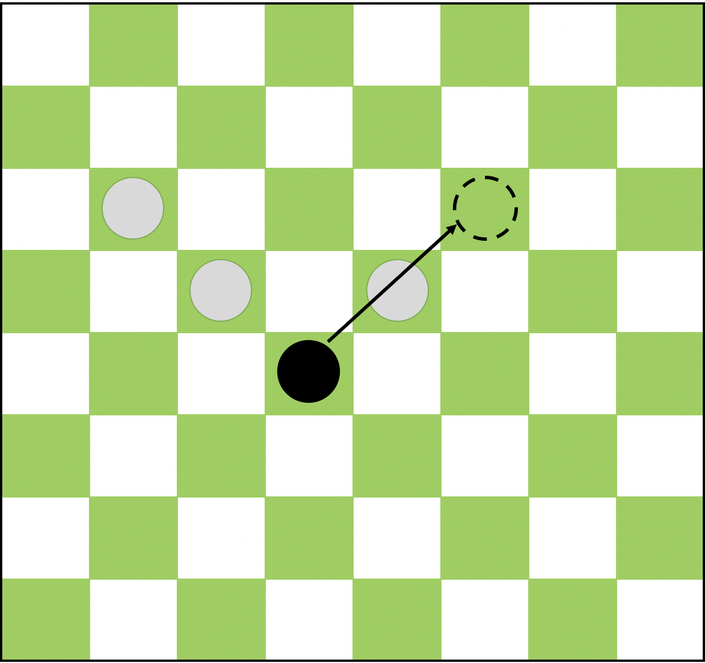

# 国际跳棋程序设计大项目

[TOC]

v0.0.2 [2019-11-10]

**注意：该内容可能会随时更新，以最新版为准。**

## 项目简介

该项目是个人项目，学生需要**独立**完成。学生需要使用 C 语言实现一个“国际跳棋”走子程序（以下称为大脑程序），使用 stdin 来接收对手落子情况、通过计算后使用 stdout 输出自己的落子（见输入输出格式）。算法不限，但有时间和内存上的限制（见比赛规则）。

学生需要将大脑程序的源码递交到指定的在线评测平台。平台会对所有同学的大脑程序两两进行机-机“国际跳棋”对抗比赛。比赛获胜方可获得积分。学生在该项目中取得的最终成绩取决于在平台上比赛总积分的名次（见排名和评分规则）。

## 对抗规则

1. 每个大脑程序都会与其他学生的大脑程序各进行一场比赛，每场比赛都有多局。

2. 为了确保公平性，每一场比赛都进行偶数局，对于一方来说，其中一半的局执黑、一半的局执白。

## 比赛规则

本规则是标准国际跳棋规则的简化版。

1. 对局采用 8 * 8 绿白棋棋盘，见“附录-棋盘”
2. 对局开始时，每方各12颗棋子，摆放在最下或者最上的三行中，每行仅在绿色格子中摆放棋子。见“附录-初始局面”。
3. 黑子先行，双方轮流操作。每次操作，可以移动自己的一枚棋子到周围的空棋位，移动的方向为向前的2个斜线方向，每次只能移动一格。示例见“附录-棋子移动”
4. 吃子的规则如下，具体的示例如附录所示：
   1. 吃掉棋子的移动是沿着对角线跨过被对手的棋子占领的方格直接跳到紧接着的空方格上。吃掉棋子的移动叫做“跳”。这个吃掉棋子的移动完成后，被吃掉（跨过）的棋子要从棋盘上拿掉。见“附录-吃子”
   2. 有吃必吃：如果遇到能吃掉对方棋子的机会，那么必须吃掉对方棋子。
   3. 有多吃多：对弈时如果出现一枚棋子(或多枚棋子)同时可以顺着两条(或多条)路线去吃对方棋子的情况时，吃子方必须选择吃子数量最多的路线行棋，而不能考虑哪条路线对自己有利。
   4. 一次取净：吃多枚棋子时，必须要在跳跃结束后，一次将被吃的棋子顺序或倒序逐个全部从棋盘上取走，不能跳一枚，取一枚。
   5. 不准重跳：当在对局中，如果遇到：一方可按两条(或多条)路线吃对方的棋子时，在吃子的过程中不能两次(也包括多次)吃掉和跳过一枚棋子。
5. 行棋过程中，在己方棋子到达对方侧的底线前，己方棋子只能向前移动；当一颗棋子到达了对方底线之后，这颗棋子可以向任意向的斜线移动，移动步数仍为1步。**注意，此处与标准国际跳棋规则中不同**
6. 吃子不受方向的限制。
7. 轮到己方走子时，大脑程序需要在2秒时间内给出落子方案。
8. 每一局游戏最多进行60个回合，
   1. 如果在60回合之前，有一方棋子都被吃掉，或者所有己棋都无法移动，则对方获胜。
   2. 如果达到60回合，则按棋盘上剩余棋子的局面判断胜负：
      1. 每个到达对方底线的棋子计3分，其余棋子计1分
      2. 分数高者获胜
9. 每一局中，己方不能使用超过 90 秒的总时间（对方走子时不算己方用时）。
10. 大脑程序任何时刻都不能使用超过 350 MB 的内存。
11. 在对方走子时，己方的程序会继续保持运行。

注意：

1. 若某一方首先超出时间限制或空间限制，或程序异常退出，则判该局这一方负。

2. 学生递交的代码会在云平台上运行，视平台任务压力不同，助教可能随时调整硬件配置调节压力，因此代码需要能在不同的 CPU 配置下都不超过时间限制。

3. 大脑程序将绑定在一个 CPU 核心上运行，因此使用多线程不会带来速度提升。

4. 大脑程序将运行在沙盒中，互相隔离，没有文件读写权限。调用被限制的函数可能会导致异常退出。

## 排名和评分规则

1. **项目截止时间为十六周周日（12月22日）晚23:59，答辩时间为第十七周**
2. 对于每一场比赛，赢得局数较多的一方获得该场比赛胜利，另一方负，否则平。
3. 胜一场比赛获得 3 积分；平一场比赛获得 1 积分；负一场比赛不获得积分。
4. 一个同学的总积分是其大脑程序与其他同学最新大脑程序比赛的积分总和。
5. 学生可以递交多次大脑程序，每次递交都会重置总积分，即总积分会按照最新一次递交的程序累计。
6. 为了避免资源被滥用，每个学生有递交频率上限，包括每两次递交代码的最短间隔限制，和今日代码已消耗时间的限制。这些频率上限会随时调整，调整时会在 QQ 群公告；学生也可以在[在线评测平台][portal]的递交界面里看到当前递交频率限制。
7. 学生递交的代码不得超出 1 MB 大小。一般情况下代码不会长到超出这个限制。
8. 学生在该项目中的成绩取决于以下因素：

   - 主要因素：项目截止时的总积分排名（排名越高则成绩越高，反之亦然）

   - 次要因素：答辩情况
9. 学生需确保最终代码的美观、可读，包括拥有一致的缩进、一致的变量命名、良好的代码组织、尽可能避免重复代码等，否则将视情况至多扣除总分的 30% 分数。
10. 学生任何时刻不得抄袭网上现有代码或其他学生代码（包括非最终版代码），一经发现并核实，本门课将直接以作弊处理。

## 比赛积分示例

例如，设总共有 A,B,C,D 四个同学递交了大脑程序 A1,B1,C1,D1，那么排行榜将来自于以下六场比赛的总积分（双方轮流执黑，则每场比赛有 2 局，总共有 12 局）：

A1 vs B1, A1 vs C1, A1 vs D1

B1 vs C1, B1 vs D1

C1 vs D1

后来，A1 递交了一个新的大脑程序 A2，那么排行榜则会变成来自于以下六场比赛的总积分：

A2 vs B1, A2 vs C1, A2 vs D1

B1 vs C1, B1 vs D1

C1 vs D1

请注意，A 同学第一次递交的大脑程序 A1 已经不在排行榜的计算范围之内了，排行榜总是反映了各同学最新的一份大脑程序的相互对战结果。

## 输入输出格式

学生的国际跳棋大脑程序需要从标准输入 (stdin) 接收指令，并相应地做出响应，将响应输出到标准输出 (stdout)。每一个指令都独占一行。大脑程序的响应也需要独占一行（即跟随一个换行符 `\n`）。以下是大脑程序需要支持的指令：

### START [FIELD]

在开始对局前，大脑程序一定会收到该指令，指令表明了己方有关的信息。`FIELD` 代表该己方大脑执子颜色，`FIELD` 为 `1` 时代表己方执黑棋，`FIELD` 为 `2` 时代表己方执白棋。

收到该指令后，大脑程序需要在1秒响应 `OK`，否则判负。

#### 示例

平台发送指令：

```
START 1
```

大脑程序回复：

```
OK
```

### PLACE N [X1,Y1] \[X2,Y2] ... [XN,YN]

该指令代表一次对手的行棋，`N`表示本次行棋中棋子共经过的格子数，`X1`、`Y1` 是对手要移动棋子的行列坐标（坐标从 0 开始），`X2` 、`Y2`是棋子要移动到的行列坐标，以此类推。

大脑程序不需要回复该指令。

对于一次棋子的移动，`X`和 `Y`用`,`（英文逗号）分隔；如果对手连续移动棋子，则每次落子之间用空格隔开。

#### 示例

平台发送指令：

```
PLACE 3 1,1 3,3 1,5
```

大脑程序不需要回复。

### TURN

该指令代表轮到己方操作。大脑程序收到该指令后，经过计算得出己方走子，并将要移动棋子经过的格子数，每个格子的行坐标、列坐标以逗号分割作为响应内容，如果连续移动棋子，则每次移动的指令间用空格隔开。大脑程序需要在指定时限内做出走子响应，否则判负。

该指令可能直接出现在 `START` 指令之后，即己方执黑棋开局；也可能出现在一次 `PLACE` 指令之后，即对手落子完毕轮到己方落子。注意，若对手落子完毕后游戏直接结束，则 `PLACE` 指令之后不会跟随有 `TURN` 指令。

#### 示例

平台发送指令：

```
TURN
```

大脑程序回复：

```
3 7,7 5,5 3,3
```

### END [FIELD]

代表该局比赛结束，其中 `FIELD` 代表获胜方，`FIELD` 为 0 时是平局，`FIELD` 为 `1` 时是己方获胜，为 `2` 时是对方获胜。在收到该指令后，大脑程序不需要做任何响应，可以自行决定是否要退出程序（在评测时，无论大脑程序是否主动退出，它最后都会被关闭）。该指令可能在任何时刻出现，例如出现在 `BEGIN` 前的话，可能是对手程序崩溃导致的这场比赛直接结束。

特别注意：在大脑程序启动后、没收到该指令前，大脑程序的自行提起退出将会导致被判负。

#### 示例

平台发送指令：

```
END 1
```

大脑程序不需要回复。

## 调试指令

为了方便调试，大脑程序可以在任何时刻输出 `DEBUG [MESSAGE]`（需要独占一行，且不能超出一行）。该内容将会被记录到日志，而不会被平台处理。学生可以在平台上下载到完整的日志从而方便调试 bug。大脑程序可以调试输出任意多次，但单条 `MESSAGE` 不能大于 16 KB（超出部分会被截断）且所有 `MESSAGE` 累计不能超过 32 KB（超出部分会被忽略），而不会记录到日志。

注意：该输出不能替代其他任何指令的响应。例如收到 `TURN` 指令后，需要响应一个坐标，那么输出 `DEBUG [MESSAGE]` 后，大脑程序仍然需要继续输出坐标。

### 示例

大脑程序输出：

```
DEBUG Hello World!
```

## 直接终止判负的情况

以下是一部分可能导致比赛中途终止直接结束并判负的情况。

### 在不允许响应的情况下响应

例如，己方刚刚响应完 `TURN` 指令，需要等待下一个 `TURN` 之后再走子。若此时己方继续输出内容（调试输出除外），则直接判负。

### 响应内容格式不正确或无效走子

例如，对于 `TURN` 指令，己方需要响应一对空格分割的坐标和要移动的方向。若响应的内容格式不正确（调试输出除外），则直接判负。若响应的坐标在棋盘以外，或指定的位置处没有我方棋子，或者要移动后的新的位置不是空棋位，则也判负。

### 超出时间限制或空间限制

时间限制包括单个指令的时间限制和总时间限制。对于 `START` 指令，需要在 52秒内响应；对于 `TURN` 指令，需要在指定的单步走子时间内响应，见比赛规则。总时间限制同样见比赛规则，它的计算从 `START` 开始，到 `END` 结束，期间对方落子时不计时间。

### 程序自身崩溃

由于各种原因（如访问无效内存地址）程序崩溃了，则该局直接判负。

## 编程注意事项

1. `scanf` 函数在没有数据可供读取时会阻塞，因此请勿在不该读取指令的时候读取指令。例如轮到你的 AI 输出了，却执行了一句 `scanf`，那么你的程序就会无限等待下去直到超时。

2. 大多数情况下，`printf` 的输出会被缓存而不会立刻输出，这会导致超时。可以使用 [fflush](http://www.cplusplus.com/reference/cstdio/fflush/) 函数解决这个问题：请在 `printf` 后紧跟语句 `fflush(stdout)` 来刷新缓冲区。

3. 若想利用对方走子的时间进行计算，你可能需要使用多线程技术。由于平台环境是 Windows，因此建议使用 Windows 平台下相关 API 以免出现不兼容情况。

4. 特别提醒：若要使用高级算法，请确保能在答辩时应对关于该算法的提问，否则将被视为抄袭。

## 在线评测平台操作说明

1. 在电脑上使用较新版本 Chrome 或 Firefox 浏览器打开平台地址http://202.120.167.41:99 。

2. 点击导航栏右上角 “Sign In” 按钮登录，用户名和密码都是你的学号（若无法登录，请联系群里的助教）。

3. 若你是第一次登录，会要求你修改到一个新密码，以免账号被别人冒用。另外还会要求你输入一个昵称。这个昵称会显示在首页的记分牌上，所有人都能看得见，且以后也可以随意修改。

4. 导航栏上点击 Scoreboard 可以看到记分牌，即当前的总积分排名。记分牌十分钟更新一次。

5. 导航栏上点击 Submission 后，右侧菜单中可以切换界面到你自己的递交记录（My Submissions）、别人的递交记录（All Submissions）或递交新代码（Submit New Brain）的页面。

6. 递交新代码时，请将你的代码合并到一个单一文件中进行递交，不支持递交多个文件。你还可以选择不同的编译器。

## 评测环境

计划于2019-11-17日前完成并上线，同时发布样例代码。

## 参考资料

1. [国际跳棋比赛规则](http://games.sports.cn/topicmatch/jc/index.html)
2. [国际跳棋试玩](http://www.4399.com/flash/116133_2.htm)

## 附录

### 棋盘



棋盘样式如图，其中左下角的绿色格子坐标为(7,0)，右下的白色格子坐标为(7,7)，左上的白色格子坐标为(0,0)，右上的绿色格子坐标为(0,7)

### 初始局面



### 棋子移动



### 吃子

黑棋行棋时，遇到如下局面，则可以进行吃子。



注意，此时只能从按照上图箭头所示方向吃子。被吃掉的棋子将会被拿掉。

